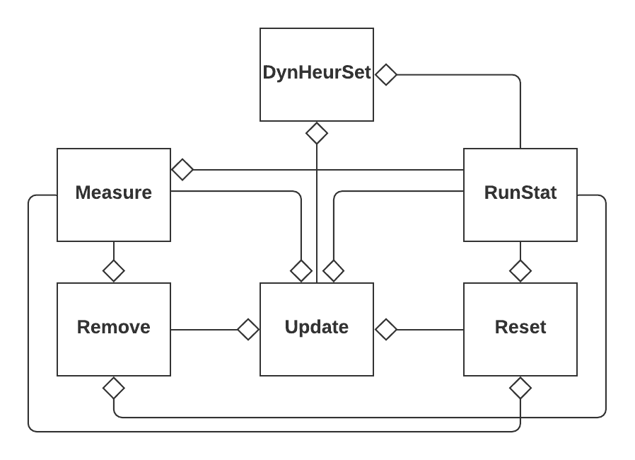

# JDHS
**_A Java Library for Dynamic Heuristic Sets_**

<p align="center"></p>

JDHS is a java library for dynamic heuristic sets (dynamic set) developed by [Nature-Inspired Computing Optimization 
Group (NICOG)](https://www.cs.up.ac.za/cs/nicog/). JDHS can be used within hyper-heuristics to manage the set of low-level heuristics utilized 
by the _selection hyper-heuristic_. 

The library assumes that all heuristics available for a problem domain
are identified by unique integers. The set of all heuristics in a problem domain is called the **universal set**
and the set of heuristics available for the hyper-heuristic to select from is called the **active set**.
The basic idea of dynamic sets is to change the active set at different phases during the search based on
the heuristic performance and search-status information from the hyper-heuristic. 

The active set contains the **indexes** of heuristics in the universal set.
For example, if a universal set is `[0,2,4,6,8]` and the active set is `[1,3]`, 
then the heuristics at indexes 1 and 3 in the universal set are available which 
are the heuristics identified by 2 and 6.

# Table of Content
1. [Features](#features)
2. [Overview](#overview)
3. [Usage](#usage)
4. [Advance Usage](#advance-usage)
5. [Contribution](#contribution)
6. [Citation](#citation)
7. [License](#license)
8. [API](#api)
9. [Compile](#compile)
10. [Acknowledgement](#acknowledgement)

# Features
1. Platform-independent written in Java to enhance portability.
2. [HyFlex](#link) compatible. Researchers using HyFlex can easily integrate JDHS into their hyper-heuristic.
3. Hyper-heuristic independent. Any selection hyper-heuristic can use JDHS.
4. Made of decoupled components facilitating fast development, prototyping, and testing.
5. Extendible. JDHS can be easily extended by implementing some _core abstract_ classes that capture key functionalities of dynamic sets such as the update strategy and removal strategy.
6. Battery-included. Several update strategies, removal strategies and performance measures are provided out of the box.
7. Concurrent programming is supported. Runs can be executed in parallel.
8. Over 20 statistics generated from the runs are wrapped in a result object and can be easily retrieved. 

# Overview
In JDHS, dynamic sets are built from _abstract (core)_ classes. To create a new your 
own dynamic set, you need to extend these classes. Currently, JDHS contains dozen of 
concrete classes that extend the core classes so you do not have to reinvent the wheel. 
You can just use them . The UML Class diagram of dynamic sets as implemented in JDHS is shown below. 

<p align="center"></p>

### DynHeurSet 
`DynHeurSet` is the main class representing a fully functional dynamic heuristic set. 
It should be integrated into a hyper-heuristic to manage the set of low-level heuristics 
utilized by the hyper-heuristic. Your hyper-heuristic should have a field
of type `DynHeurSet`

In general, you do not have to touch this class. To **create** your own dynamic set, 
you just need **extend** the following _core abstract_ classes: `Measure`, `Update`,  
`Remove`, `Reset`. These core classes specifies how a dynamic set works. JDHS comes 
with several concrete classes for these core abstract classes so that you can use them out of the box.


### RunStat
`RunStat` is mainly used for storing run-related information such as the objective 
function values, the elapsed time, the percentage improvement (disimprovement) achieved
(caused) by each heuristic. Every core class has a field of type `RunStat` to inquire
it about the run-related information so that the core class can make informed decisions.
This field is shared by all core classes. Therefore, there is **one** instance of `RunStat`
associated with the dynamic set (and its core classes).

### Measure
The `Measure` class provides a method to measure the performance of each heuristic and is used 
by the `Update`, `Remove`, and `Reset`. For instance, the update strategy (instance of
type `Update`) uses the `Measure` field to decide which heuristic to include in the active set
Visit [this page](src/dynheurset/measure) to see all performance measure implemented in JDHS.

### Remove
The `Remove` class implements a _removal strategy_ which decides the _removal condition_ 
(when to remove) and the _removal criterion_ (which heuristics to remove permanently). 
Visit [this page](src/dynheurset/update/remove) to see all removal strategies implemented in JDHS.

### Reset
The `Reset` class specifies the condition of triggering a _reset operation_. that restores
the **active set** (the set of low-level heuristics that 
a hyper-heuristic can select from) to include all low-level heuristics except for 
permanently removed heuristics. Visit [this page](src/dynheurset/update/reset) to see all reset
conditions implemented in JDHS.

### Update
The `Update` class implements the _update strategy_ that specifies the _update condition_ 
(when to update the active set) and the _update criterion_ (how to update the active set). 
Visit [this page](src/dynheurset/update) to see all update strategies implemented in JDHS.


# Usage
### Create dynamic set
To use a dynamic set in your hyper-heuristic, you need to follow the steps shown below. 
Please note that this is just an example for the illustration purpose. 
You can create dozens of dynamic sets out of the components implemented in JDHS.
```java
DynHeurSet dynset = new DynHeurSet();
RunStat runStat = new RunStat();
//`dynset` needs `runStat` to track performance statistics during the run
dynset.setRunStat(runStat);

//Now, we need to specify how `dynset` will work by specifying its components
//Measure the performance by the frequency of improvement
Measure measure = new ImprFreqMeasure();
//Use the dominance update strategy with a phase length of 10 iterations
Update udpate = new PhaseDominanceUpdate(10);
//`update` needs `runStat` to be informed about the performance statistics
udpate.setRunStat(runStat);
//Define the performance measure
udpate.setMeasure(measure);

//Permanently remove the worst heuristic with a frequency of removal of 25%
//We will perform the removal 4 times during the search.
Remove remove = new FreqWorstRemoval(0.25);
//Let the update strategy knows about the removal strategy
//This will also set the `Measure` field the `Remove` object to be the same as 
//the measure `of the `Update` object.
udpate.setRemove(remove);
//We do not need a reset strategy
Reset reset = new NoReset();
//Let the update strategy knows about the reset strategy
udpate.setReset(reset)
//Now, the update strategy is all set including its measure, removal strategy, 
//and reset strategy.  Therefore, let `dynset` use it
dynset.setUpdate(udpate);
```

### Integrate Dynamic Sets Into Hyper-Heuristic
Now you created a fully functional dynamic set, you just need to integrate it with your 
hyper-heuristic. To do that, there are two ways depending on how you implement your 
hyper-heuristic:
1. If your hyper-heuristic _does not extend_ a superclass.
2. If your hyper-heuristic _extends_ a superclass such as the hyper-heuristics that use the HyFlex framework.

In the first case, your hyper-heuristic needs to extend `GenericHyperHeuristic` 
which is a class that offers generic hyper-heuristic functionalities. 
You just need to implement the `solve` method which should contain the logic of your hyper-heuristic. 

In the second case, your hyper-heuristic needs to implement the `HyperHeuristicIntrf` interface 
(multiple inheritance is not supported in Java). Your hyper-heuristic should have a field of type
`DynHeurSet` which represents the dynamic set your hyper-heuristic will use.
The, You need to implement the `setDynSet` method of the `HyperHeuristicIntrf` interface 
to make your hyper-heuristic aware of the dynamic set. 

**Note:** all methods of the `HyperHeuristicIntrf` have a default implementation that throws 
`UnsupportedOperationException` so that you _do not have to implement them_ if you do not 
need them in your hyper-heuristic. However, if you use dynamic sets you will have to implement
`setDynSet`.

After doing that, whether your hyper-heuristic extend a superclass or not, you need 
to follow the steps explained below. first, you need to set up the `DynHeurSet` field 
of your hyper-heuristic. This field is called `dynset` in `GenericHyperHeuristic`. 
You can call it anything else in your hyper-heuristic if you do not extend `GenericHyperHeuristic.

```java
//This method should be called when your hyper-heuristic starts the search
//Sets the maximum computational time (`timeLimit` is in millisecond)
dynSet.setMaxTime(timeLimit);

//Let `dynset' know about your low-level heuristics. Note `heurArray` is an integer 
//array that contains unique identifiers for the heuristics
//`heurArray` is the universal set
dynSet.setHeurList(heurArray)

//This method should be called when your hyper-heuristic creates an initial solution
//Assign the initial solution value.
dynSet.init(initValue);
```

Now, our dynamic set is set up correctly and read to go. Inside the optimization loop of your hyper-heuristics, 
you need to call two methods: `updateActiveList()` and `updateHeurValue(heurIdx, 
currentValue, newValue, duration)` of the `dynset` field of your hyper-heuristic.  

At the _start of every iteration_ of your hyper-heuristic, call  `updateActiveList()` 
to get the currently active set. 

**Important Note:** This method will return an array list of integers which contains 
the **indexes** of the heuristics as appear in `heurArray` (the universal set which is
the argument of the method `setHeurList` in the code snippet above). For instance, 
assume the universal set is `[0, 2, 4, 6, 8]`. If the active set is `[1, 3]`, then this
means that the heuristics identified by 2 and 6 are currently active and available 
for your hyper-heuristic whereas other heuristics are not available.

After you applying a heuristic, you need to call `updateHeurValue(heurIdx, 
currentValue, newValue, duration)` to record its performance. 
Here, `heurIdx` is the **index** of the heuristic that is applied in the universal set.
For instance, assume the universal set is `[3, 5, 7, 9]` and the heuristic identified
by 5 is applied, then `heurIdx` is 1. `currentValue` and `newValue` are the values 
before and after applying the heuristic respectively, and `duration` is the time 
in millisecond taken by the heuristic to execute the move.
This is an example on how to use a dynamic set inside the optimization loop of your hyper-heuristic
```java
ThreadMXBean bean = ManagementFactory.getThreadMXBean();
//Entering the optimization loop of your hyper-heuristic
while(!hasTimeExpired()){
    //Get the active set at the start of every iteration
    //This will update the currently active set only if an update condition is met
    //Otherwise, it returns the currently active set as is
    List<Integer> activeList = dynSet.updateActiveList();
    //Choose a heuristic to apply at random
    int heurIdx = activeList.get(rng.nextInt(activeList.size()));
    //Assuming that `allHeurs` is the universal set that contains the integer identifiers
    //of all heuristics
    int heurToApply = allHeurs[heurIdx];
    //Measure the execution time for the current heuristic
    long before = bean.getCurrentThreadCpuTime();
    //Apply the heuristic to the solution at index 0 in the solution memory
    //and store the new solution at index 1 in the solution memory
    double newValue = problem.applyHeuristic(heurToApply, 0, 1);
    //Measure the execution time of the heuristics in millisecond.
    long duration = 1 + (bean.getCurrentThreadCpuTime() - before)/1000000L;
    //Update the heuristic information
    dynSet.updateHeurValue(heurIdx, currentValue, newValue, duration);
    
    //Update `currentValue` by `newValue` according to your acceptance criterion
}
```

### Running Simulation
In general, hyper-heuristics are stochastic. Therefore, multiple runs are typically 
required to achieve statistical significance.  JDHS supports executing the runs in parallel. 
To do that you need to extend the `GenericRunner` class and implement three abstract methods:
1. `createProblem`: returns an object of type `Problem` which represents the problem 
that the hyper-heuristic will solve. **Note:** If you are using HyFlex, then you 
need to implement `createHyFlexProblem` instead which returns an object of type `ProblemDomain`.
2. `createHyperHeuristic`: returns an object of type `HyperHeuristicIntrf` which 
represents your hyper-heuristic. **Note:** if you are using HyFlex, you need to implement 
the `setDynSet` method of the `HyperHeuristicIntrf` interface.
3. `createDynHeurSet`: returns an object of type `DynHeurSet` which is created as explained [here](#usage).

For a complete example for extending `GenericRunner` refer to [here](src/runner/examples/SkiLodgeRunner.java)
if your hyper-heuristic does not use HyFlex or refer to [here](src/runner/examples/HyFlexRunner.java) if your hyper-heuristic
uses HyFlex.

Once these methods are implemented, you can run the simulation as follows (assuming 
that `MyRunner` is the class you implemented to extend `GenericRunner` ):

```java
//Create a runner object. 
//`seed` is the seed for the random number generator used to generate a unique seed 
//for each run `timeLimit` is the maximum computational time in millisecond.
GenericRunner runner = new MyRunner(seed, timeLimit);

//Run the simulation in parallel using all available cores and retrieve the results
Result result = runner.run(numRuns);

//Now, you can inquire the result object
double min = result.min() //minimum value of all runs
double mean = result.mean()
double max = result.max();
double std = result.std();  //standard deviation
//Percentage improvement for each heuristic averaged across all runs
//`percImpr[idx]` is the result for the heuristic indexed by idx in the universal set
double[] percImpr = result.avgImprovement();
```

**Note:** there are over 20 methods of the `Result` object that provide information about the run which can be found [here](src/runner/Result.java).

That is all! Please refer to the [examples](src/hyperheuristic/examples) package for complete examples of hyper-heuristics using JDHS.


# Advance Usage

### Using Several Dynamic Sets
[Previously](#usage), we created a dynamic set and integrated it into a hyper-heuristic. Sometimes, you may want to use different _instances_ of the _same_ dynamic set to manage 
different types of low-level heuristics. For instance, You can use an instance of
the same dynamic set to manage perturabtive heuristics (mutational + ruin and recreate)
and another instance to manage local search heuristics. In this section, we will show you
how to do that. Fortunately, JDHS will do all the heavy lifting for you.

First, _if your hyper-heuristic does not extend a superclass_ you just need to extend `GenericHyperHeuristic` 
and implements its `solve` method which should contain your hyper-heuristic logic. Then,
follow the steps explained [here](#usage) to set up your dynamic sets and use them inside
your hyper-heuristic.

Second, _if your hyper-heuristic extend a superclass_, your need to implement `HyperHeuristicIntrf`
to be able to use dynamic sets and implement `setPertDynSet` (which sets the dynamic set that will
manage the perturbative heuristics) and `setLsDynSet` (which sets the dynamic set that will manage
the local search heuristics). Your hyper-heuristic should have two fields of type `DynHeurSet` (say
`pertDynSet` (for perturbative heuristics) and `lsDynSet` (for local searches).

Then, regardless of whether your hyper-heuristic extend a superclass or not, you need to set up `pertDynSet`
and `lsDynSet` and use them inside your hyper-heuristic follows:

```java
    //BEFORE the optimization loop
    //Sets the maximum time. `timeLimit` is in millisecond
    pertDynSet.setMaxTime(timeLimit); //for perturbative heuristics
    lsDynSet.setMaxTime(timeLimit); //for local search heuristics
    
    //Set the universal set of perturbative heuristics
    //`pertHeurs` is an array of integers representing the perturbative heuristics
    pertDynSet.setHeurList(pertHeurs);   
    //Do the same for local searches
    lsDynSet.setHeurList(lsHeurs);
    
    //Set the initial value of the objective function
    pertDynSet.init(currentValue);
    lsDynSet.init(currentValue);

    //INSIDE the optimization loop
    while(!hasTimeExpired()){
        /* We will apply a perturbative heuristic followed by applying a local search */
        //Get the active heuristic set for perturbative heuristics
        List<Integer> pertActiveList = pertDynSet.updateActiveList();

        //Choose the index of the heuristic to apply
        int pertHeurIndex = pertActiveList.get(rng.nextInt(pertActiveList.size()));        
        //Choose the heuristic to apply
        //Recall that `pertHeurs` is the universal set of perturbative heuristics
        int heurToApply = pertHeurs[pertHeurIndex];

        //Measure the execution time for the current heuristic
        long pertBefore = bean.getCurrentThreadCpuTime();
        //Apply the heuristic to the solution at index 0 in the solution memory
        //and store the new solution at index 1 in the solution memory
        double pertValue = problem.applyHeuristic(heurToApply, 0, 1);                        

        //Do NOT update the value for the current perturbative heuristic yet.
        //We evaluate the "value" of a perturbative heuristic by the solution
        //value generated AFTER applying the local search heuristic.

        /* Apply a local search heuristic */
        //Get the active heuristic set for local searches
        List<Integer> lsActiveList = lsDynSet.updateActiveList();
        //Choose the index of the heuristic to apply
        int lsHeurIndex = lsActiveList.get(rng.nextInt(lsActiveList.size()));
        //Choose a local search heuristic to apply
        //Recall that `lsHeurs` is the universal set of local searches
        heurToApply = lsHeurs[lsHeurIndex];

        //Measure the execution time for the current heuristic
        long before = bean.getCurrentThreadCpuTime();
        //Apply the heuristic to the solution at index 1 in the solution memory
        //and store the new solution at index 1 in the solution memory
        double newValue = problem.applyHeuristic(heurToApply, 1, 1);
        
        //Compute the time taken
        long duration = 1 + (bean.getCurrentThreadCpuTime() - before)/1000000L;

        //Update the "value" of the heuristic used. Note we use the index here
        lsDynSet.updateHeurValue(lsHeurIndex, pertValue, newValue, duration);

        //AFTER applying the local search, we can now update "value" of the
        //perturbative heuristic. This makes sense since good perturbative 
        //heuristics should help local searches to escape local optima
        duration = 1 + (bean.getCurrentThreadCpuTime() - pertBefore)/1000000L;
        pertDynSet.updateHeurValue(pertHeurIndex, currentValue, newValue, duration); 

        //Update `currentValue` by `newValue` according to your acceptance criterion
    }
```

So far, you created two dynamic sets to manage perturbative heuristics and local searches 
separately. You also integrated these dynamic sets into your hyper-heuristic. Now, you are
ready to run the simulation. Follow the same steps explained [here](#running-simulation) 
except for one difference: this time, you will call `run2` method of `GenericRunner` instead of calling `run`. 
The complete code:

```java
GenericRunner runner = new MyRunner(seed, timeLimit);
List<Result> resultList = runner.run2(numRuns);

//Get the results for the dynamic set for perturbative heuristic
Result pertResult = resultList.get(0);
//Get the results for the dynamic set for local search heuristic
Result lsResult = resultList.get(1);

//You can now, inquire the `Result` objects as you did before
double min1 = pertResult.min();
double min2 = lsResult.min();
```

Note that `run2` returns an object of type `List<Result>` which contains two `Result` objects: 
the first one wraps the results of the dynamic set used for perturbative heuristics 
and the second one wraps results of the the dynamic set for local search heuristics.

**Note:** it is generally preferred to have descriptive names for the methods. 
The suffix 2 in `run2` method indicates that two dynamic sets are used. If you are using 
3 dynamic sets to manage different types of heuristics, you need to add a method 
to the `GenericRunner` class and preferably call it `run3` which should be implemented
following the steps done in `run2`.

For a complete example on how to use two dynamic sets in your hyper-heuristic to manage
the perturbative heuristics and local searches separately, visit 
[here](src/hyperheuristic/examples/ExampleHyperHeuristic2.java).


# Contribution
If you would like to contribute to JDHS, please follow the instruction provided [here](docs/contribution.md).

# Citation
If you use JDHS in your research, please cite the following paper:
```
The paper is accepted in TPNC but not yet published. We will update this soon.
```

# License
This software is released under a creative commons license which allows for personal 
and research use only. For a commercial license please contact the authors. 
You can view a license summary [here](https://creativecommons.org/licenses/by-nc/4.0/)

# API
The documentation of JDHS can be accessed [here](#link).

# Compile
To compile JDHS, you need to add `chesc.jar` to your class path. This jar file can be 
found [here](lib/).

If you are using NetBeans, you can easily add the jar file:

* Right click `libraries`
* Choose `Add JAR/FOLDER` and browse to the location of `chesc.jar`
* Choose `Open`

If you are using the command line, it is easier to include all `.java` files in
a source file: `find -name "*.java" > sources.txt` assuming that you execute this
command from inside the _root directory_ of the repository.
Then, compile: `javac -cp ./src:./lib/* @sources.txt`.
Finally, run the application: `java -cp ./src/:./lib/* dynheurset.Main`

In Windows, you need to replace `:` in the class path by `;`.

That is all!
 
# Acknowledgement
This work is funded as part of the Multichoice Research Chair in Machine Learning at 
the University of Pretoria, South Africa. This work is based on the research supported 
wholly/in part by the National Research Foundation of South Africa (Grant Numbers 46712). 
Opinions expressed and conclusions arrived at, are those of the author and are not 
necessarily to be attributed to the NRF.
